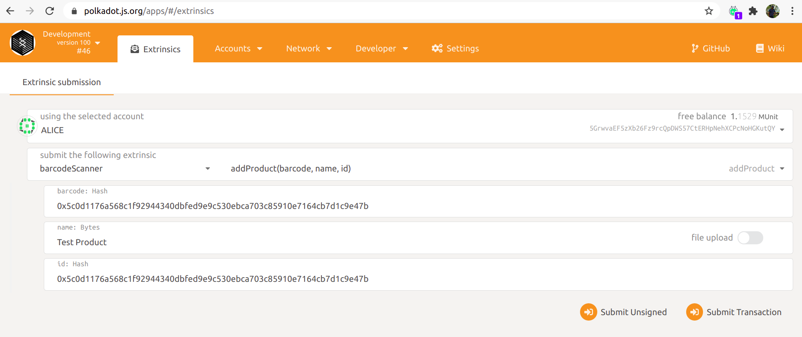

# Substrate based Product Barcode Scanner

This substrate based pallet scans 2D barcode of the product which is tied to a Blockchain system.

## Getting Started

### Rust Setup

Follow the [Rust setup instructions](./doc/rust-setup.md) before using the included Makefile to
build the Node Template.

### Makefile

This project uses a [Makefile](Makefile) to document helpful commands and make it easier to execute
them. Get started by running these [`make`](https://www.gnu.org/software/make/manual/make.html)
targets:

1. `make init` - Run the [init script](scripts/init.sh) to configure the Rust toolchain for
   [WebAssembly compilation](https://substrate.dev/docs/en/knowledgebase/getting-started/#webassembly-compilation).
1. `make run` - Build and launch this project in development mode.

The init script and Makefile both specify the version of the
[Rust nightly compiler](https://substrate.dev/docs/en/knowledgebase/getting-started/#rust-nightly-toolchain)
that this project depends on.

### Build

The `make run` command will perform an initial build. Use the following command to build the node
without launching it:

```sh
make build
```

### Embedded Docs

Once the project has been built, the following command can be used to explore all parameters and
subcommands:

```sh
./target/release/node-template -h
```

## Run

The `make run` command will launch a temporary node and its state will be discarded after you
terminate the process. After the project has been built, there are other ways to launch the node.

### Single-Node Development Chain

This command will start the single-node development chain with persistent state:

```bash
./target/release/node-template --dev
```

Purge the development chain's state:

```bash
./target/release/node-template purge-chain --dev
```

### How to add product and verify barcode

* After executing `make run`, Use this link to open the Polkadot JS Apps UI `https://polkadot.js.org/apps/#/explorer?rpc=ws://127.0.0.1:9944`
  
* Open Extrinsics and fill following inputs to add the product in storage.
  
* 
  
* Click on `Submit Transaction` and product will be added.
  
* Open terminal and execute below curl request to verify barcode

`curl -H "Content-Type: application/json" -d '{"id":1, "jsonrpc":"2.0", "method": "barcode_scanner_is_valid_barcode", "params": ["0x5c0d1176a568c1f92944340dbfed9e9c530ebca703c85910e7164cb7d1c9e47b"]}' http://localhost:9933/`

You will get below response.

`{"jsonrpc":"2.0","result":true,"id":1}`